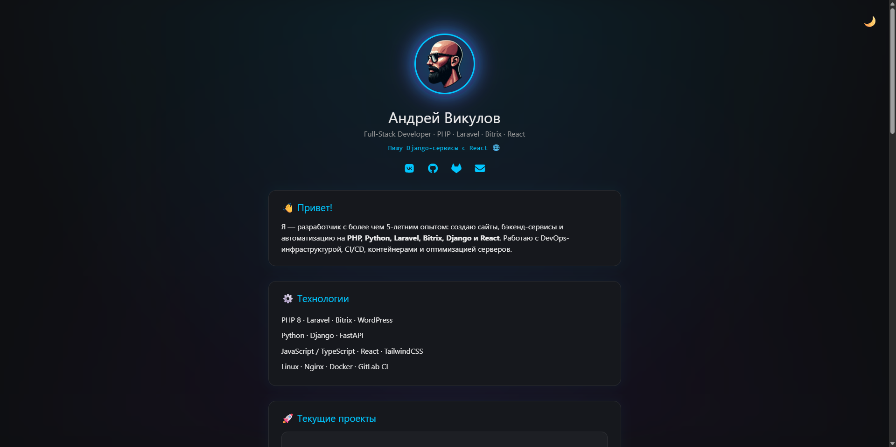

# 🌐 viku-lov.ru — Личный сайт Андрея Викулова

> **Full-Stack разработчик** · PHP · Laravel · Bitrix · Django · React · Tailwind · DevOps

Мой персональный сайт-портфолио, созданный как **чистый статический лендос** без фреймворков —  
для демонстрации навыков владения **HTML, CSS, JavaScript и TailwindCSS**.

-----



<p align="center">
  <a href="https://vproger.ru"></a>
  <a href="https://github.com/va-proger/vproger_site_vizitka_temp"></a>
  <a href="https://github.com/va-proger/vproger_site_vizitka_temp"></a>
  <a href="LICENSE"></a>
</p>

---


## 🚀 О проекте

Современная визитка-разработчика с акцентом на **скорость**, **минимализм** и **фронтенд-интерактив**.  
Всё собрано вручную — никакого билдера, CMS или сборщика.

### ✨ Основные возможности
- 🌗 **Светлая и тёмная темы** с сохранением состояния в `localStorage`
- 💬 **Cookie-модалка** с поддержкой Google Tag Manager и Yandex.Metrika
- ⚙️ **Анимации появления** с помощью `IntersectionObserver`
- 💻 **Секция GitHub-проектов** (из `projects.json`)
- 🧩 **JSON-LD microdata** и OG-теги для SEO
- 📱 Полностью адаптивный дизайн
- 🔐 Без зависимостей — только чистый JS и Tailwind

---

---

## 🧠 Технологии

| Категория | Использовано |
|------------|---------------|
| **Frontend** | HTML5, CSS3, TailwindCSS |
| **JS** | ES6, IntersectionObserver, LocalStorage |
| **SEO** | JSON-LD, Open Graph, meta-данные |
| **Analytics** | Google Tag Manager (GTM), Google Analytics 4 (GA4), Yandex.Metrika |
| **UI** | Font Awesome, адаптивные карточки, hover-анимации |
| **Deploy** | GitHub Pages |

---

---

## 🧾 Структура проекта

```

.
├── assets/
│   ├── avatar.png
│   ├── style.css
│   ├── reset.css
│   ├── main.js
│   ├── projects.json
│   ├── sert-1.png
│   ├── sert-2.png
│   └── preview-dark.png
├── index.html
├── privacy.html
└── README.md

````

---


---

## ⚡️ GitHub Projects
Список проектов, отображаемых на сайте, берётся из `assets/projects.json`.

Пример структуры:
```json
[
  {
    "name": "laravel-next-blog",
    "url": "https://github.com/vproger/laravel-next-blog",
    "description": "Блог на Laravel + Next.js 15 + Tailwind + Sanctum.",
    "tags": ["Laravel", "Next.js", "FullStack"]
  }
]
```
---

## 📈 Аналитика

| Сервис                | ID             | Тип                     |
| --------------------- | -------------- | ----------------------- |
| 🧩 Google Tag Manager | `GTM-TLC4B4B7` | Менеджер тегов          |
| 📊 Google Analytics 4 | `G-HXST11NPC2` | Сбор статистики         |
| 📡 Yandex.Metrika     | `105208622`    | Вебвизор, клики, ссылки |

---

## 🍪 Cookie Consent

При первом визите появляется модалка:

> “Мы используем cookies для улучшения работы сайта...”

После согласия:

* сохраняется `cookiesAccepted=true` в `localStorage`;
* активируется GTM / Метрика;
* отключается показ баннера.

---

## 🧰 Планируемые обновления

* 💻 **CLI-терминал-анимация** с выводом фейковых команд;
* 📊 **График навыков (Skills Graph)** на Chart.js;
* ⚡ **Генератор сниппетов** с Prism.js;
* 🧭 Плавные переходы и page-transitions;
* 🪶 Добавление OpenGraph-превью и RSS для блога.

👨‍💻 Автор

---

## 👨‍💻 Автор

**Андрей Викулов (VProger)**
Senior Full-Stack Developer / DevOps Engineer

💼 [GitHub](https://github.com/va-proger)
🌐 [viku-lov.ru](https://viku-lov.ru)
📨 [vproger@vk.com](mailto:vproger@vk.com)
📎 [VK](https://vk.com/vproger_club)

---

## 📜 Лицензия

Проект распространяется под лицензией **MIT**.
Использование кода и структуры сайта допускается с указанием автора.

---

> *“Разработка — это не просто код. Это отражение личности разработчика.”*
> — Андрей Викулов (VProger)
